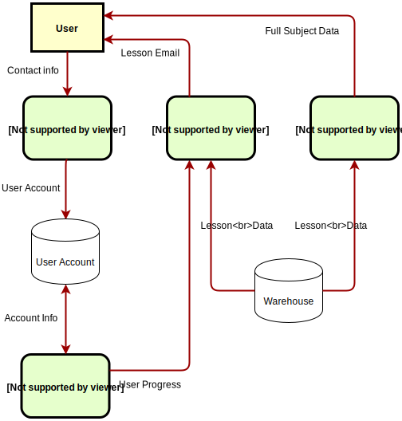
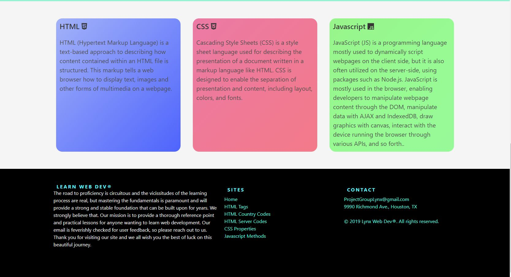

# [Email Lesson Manager](https://immense-ridge-78589.herokuapp.com/)

This is a full stack web application that provides daily lessons via email to subscribed users.

---

## Table of Contents

- [Overview](#overview)
- [Technologies](#technologies)
- [Future Development](#future)
- [Developers](#team)

---

## Overview 

1. User subscribes to the web app and receives an introductory email.

2. Server sends scheduled, daily emails containing lessons. (If none remains, an alternative reading material will be suggested.)

3. User can choose to follow the emailed link to the website, which provides further detail about the subject.

4. The web app displays related subjects that the users can explore at will.

5. Get smarter every day!

---

## Technologies 

- [Node.js](https://nodejs.org/en/)
- [NPM: Chalk](https://www.npmjs.com/package/chalk)
- [NPM: Express](https://www.npmjs.com/package/express)
- [NPM: Express Handlebars](https://www.npmjs.com/package/express-handlebars)
- [NPM: MySQL 2](https://www.npmjs.com/package/mysql2)
- [NPM: Node Cron](https://www.npmjs.com/package/node-cron)
- [NPM: Node-Sass](https://www.npmjs.com/package/node-sass)
- [NPM: Nodemailer](https://www.npmjs.com/package/nodemailer)
- [NPM: Passport](https://www.npmjs.com/package/passport)
- [NPM: Sequelize](https://www.npmjs.com/package/sequelize)
- [Heroku](https://heroku.com)
- [Heroku Add-on: JawsDB MySQL](https://elements.heroku.com/addons/jawsdb)

---

## Future Development 

- Selection-driven progression
- Additional subjects and structures
- Profile personalization
- More dynamic server-side rendering
- Database schema reorganization

---

## Developers (alphabetical) 

- [Bladimir Orellana](https://github.com/BladimirOrellana)
- [Danny Kim](https://github.com/danninemx)
- [John Paschal](https://github.com/patrickjpaschal)
- [Martin Palacios](https://github.com/martinapalacios)
    
